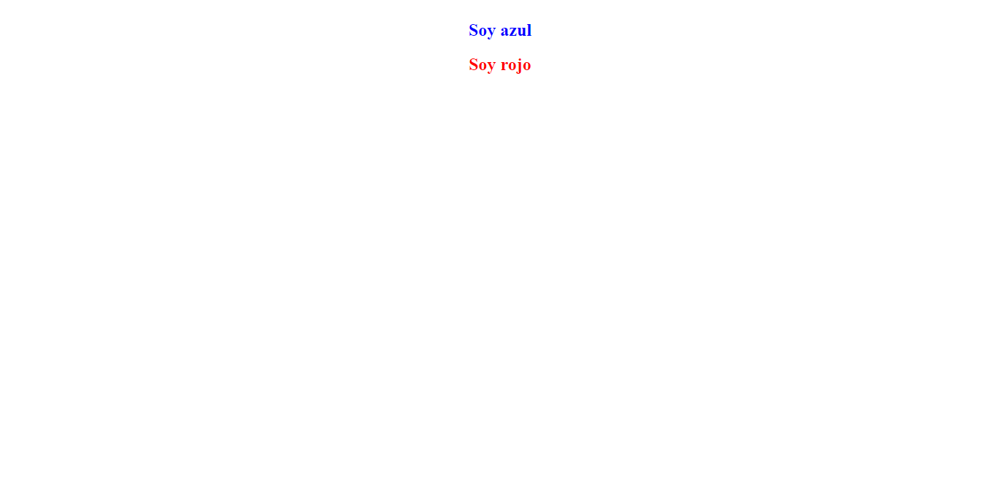
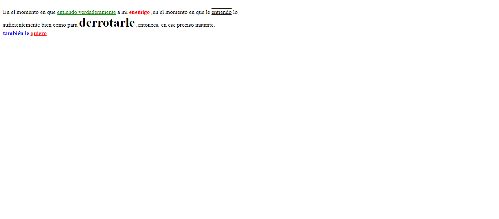
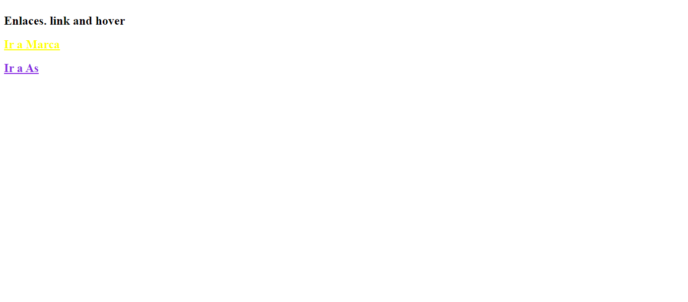
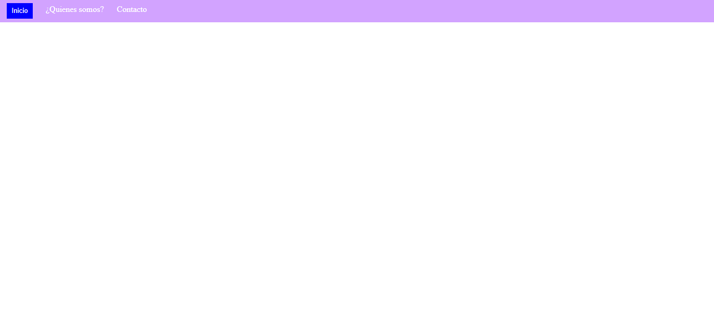
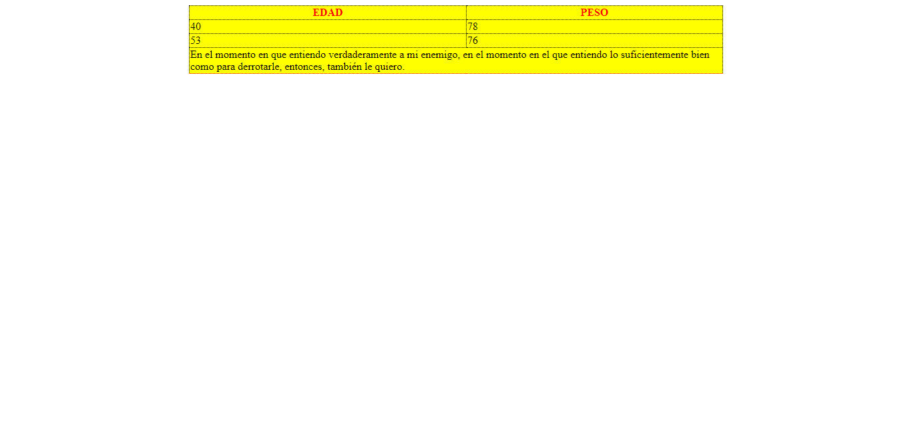

<h1>Taller Lorena Mendez</h1>

<h2>Información</h2>

Curso: Full Stack Básico - Grupo 1

Profesor: Cristian Patiño

<h2>Punto1: Link de figma</h2>
<a href="https://www.figma.com/file/bDwWepBPFpjJ3QLSrHfZrW/Figma-exercise?type=design&node-id=14-105&t=aAVpOWMCNEwqTQv8-0">Link de Figma </a>

 

<h2>Link página web</h2>
<a href="https://lorehm18.github.io/Taller-9-full-stack/">Link página</a>

<h2>Punto 2: HTML</h2>

<h2>Punto 3: CSS</h2>

<h2>Punto 4: Títulos</h2>

<h2>Punto 5: Estilos de texto</h2>

<h2>Punto 6: Enlaces</h2>

<h2>Punto 7-8: Navegación</h2>

<h2>Punto 9: Tablas</h2>

